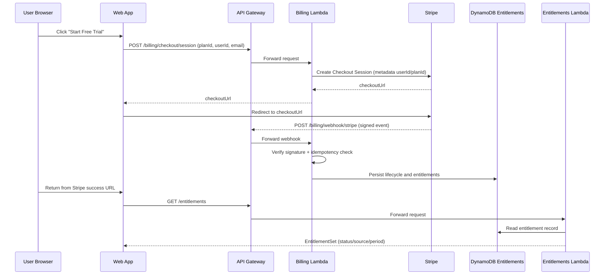

## AWS Deployment Architecture (v1)

Date: 2026-03-01

Decision references:
- `ADR-007` (minimal AWS backend scope)
- `ADR-009` (AWS web hosting model)
- `ADR-010` (payments strategy)
- `ADR-011` (infrastructure as code)

This document is an implementation-oriented deployment description (AWS EU) written to help GitHub Copilot generate:
- infra (Terraform layout),
- backend services (Lambda handlers, API contracts),
- web hosting config (SPA routing),
- security defaults (KMS, Secrets, IAM boundaries),
- cost controls (log retention, batching, throttles).

---

## 1. Deployment Diagram (Eraser)

```eraser
title: SMB Finance Toolkit — AWS Deployment (EU) (v1)

Client Devices {
  iOS Device {
    Mobile App (iOS) [icon: mobile]
    iOS Local DB (SQLite) [icon: database]
    iOS Secure Storage (Keychain) [icon: key]
  }

  Android Device {
    Mobile App (Android) [icon: mobile]
    Android Local DB (SQLite) [icon: database]
    Android Secure Storage (Keystore) [icon: key]
  }

  User Browser {
    Web App (SPA) [icon: browser]
    Web Local Store (IndexedDB) [icon: database]
  }
}

External Providers {
  Google OAuth [icon: google]
  Crash Reporting (SDK) [icon: bug]
  Stripe [icon: credit-card]

  Billing / Subscriptions {
    App Store Billing [icon: credit-card]
    Google Play Billing [icon: credit-card]
  }
}

AWS (EU Region) {

  Edge {
    Route 53 [icon: aws-route-53]
    CloudFront [icon: aws-cloudfront]
  }

  Static Hosting {
    Web App Assets (S3) [icon: aws-s3]
  }

  API Layer {
    API Gateway (HTTP API) [icon: aws-api-gateway]
  }

  Compute {
    Auth Lambda [icon: aws-lambda]
    Entitlements Lambda [icon: aws-lambda]
    Billing Lambda [icon: aws-lambda]
    Telemetry Lambda [icon: aws-lambda]
  }

  Data {
    Entitlements (DynamoDB) [icon: aws-dynamodb]
    Telemetry Storage (S3) [icon: aws-s3]
  }

  Security {
    KMS [icon: aws-kms]
    Secrets Manager [icon: aws-secrets-manager]
    CloudWatch [icon: aws-cloudwatch]
  }
}

%% Web delivery
User Browser -> Route 53
Route 53 -> CloudFront
CloudFront -> Web App Assets (S3)

%% API calls
Mobile App (iOS) -> API Gateway (HTTP API)
Mobile App (Android) -> API Gateway (HTTP API)
Web App (SPA) -> API Gateway (HTTP API)

%% Auth flow
Mobile App (iOS) -> Google OAuth
Mobile App (Android) -> Google OAuth
Web App (SPA) -> Google OAuth

API Gateway (HTTP API) -> Auth Lambda
Auth Lambda -> Google OAuth

%% Purchase flow (device -> store)
Mobile App (iOS) -> App Store Billing
Mobile App (Android) -> Google Play Billing

%% Subscription verification / entitlements (backend -> store APIs)
API Gateway (HTTP API) -> Entitlements Lambda
Entitlements Lambda -> Entitlements (DynamoDB)
API Gateway (HTTP API) -> Billing Lambda
Billing Lambda -> Entitlements (DynamoDB)
Billing Lambda -> Stripe
Billing Lambda -> App Store Billing
Billing Lambda -> Google Play Billing

%% Telemetry
API Gateway (HTTP API) -> Telemetry Lambda
Telemetry Lambda -> Telemetry Storage (S3)

%% Observability
Auth Lambda -> CloudWatch
Entitlements Lambda -> CloudWatch
Billing Lambda -> CloudWatch
Telemetry Lambda -> CloudWatch

%% Secrets / keys
Auth Lambda -> Secrets Manager
Entitlements Lambda -> Secrets Manager
Billing Lambda -> Secrets Manager
Telemetry Lambda -> Secrets Manager
Secrets Manager -> KMS
Telemetry Storage (S3) -> KMS
Entitlements (DynamoDB) -> KMS

%% Crash reporting direct
Mobile App (iOS) -> Crash Reporting (SDK)
Mobile App (Android) -> Crash Reporting (SDK)
Web App (SPA) -> Crash Reporting (SDK)
```

---

## 2. Goals & Constraints (must follow)

1. **EU-first:** all AWS resources must be deployed in an EU region.
2. **Low cloud burn:** serverless, minimal storage, tight telemetry budget.
3. **No scenario data in cloud:** scenario numeric values remain local-only in V1.
4. **Offline-first:** clients continue to work if backend is unreachable.
5. **Security baseline:** TLS everywhere, least-privilege IAM, secrets never logged.

---

## 3. Runtime Environments (Copilot guidance)

### 3.1 Web Client (Browser)
- Delivered as a static SPA from **S3 + CloudFront**.
- Stores scenarios in **IndexedDB** (local).
- Calls backend for **entitlements refresh** and **telemetry batch upload** only.
- Uses Google OAuth for login.

### 3.2 Mobile Clients (iOS / Android)
- Store scenarios in **SQLite** locally.
- Mobile DB encrypted (SQLCipher); encryption key stored in Keychain/Keystore.
- Purchases happen **on-device** via store billing.
- Backend performs **receipt/subscription verification** and returns entitlements.
- Crash reporting goes directly to the chosen crash SDK vendor.

---

## 4. AWS Components — Responsibilities & “Copilot boundaries”

### 4.1 Route 53 + CloudFront (Edge)
**Purpose:** HTTPS entry, caching, global edge delivery.

**Copilot implementation notes:**
- Configure CloudFront behavior to serve SPA routes (`/*`) with **fallback to `/index.html`**.
- Enforce HTTPS redirect.
- Use long cache headers for hashed assets; shorter for HTML.

---

### 4.2 S3 (Web App Assets)
**Purpose:** Store the web build output (static files).

**Must:**
- Block public access; CloudFront OAC/OAI only.
- Enable versioning (optional but recommended).
- Default encryption at rest (SSE-S3 or SSE-KMS).

---

### 4.3 API Gateway (HTTP API)
**Purpose:** Single backend entrypoint with minimal endpoints.

**Suggested endpoints:**
- `POST /auth/verify`
- `GET /entitlements`
- `POST /billing/verify`
- `POST /billing/checkout/session`
- `POST /billing/webhook/stripe`
- `POST /telemetry/batch`

**Rules:**
- Strict request/response schema (typed).
- Rate limit / throttling knobs (later: WAF or usage plans).

---

### 4.4 Auth Lambda (Auth Verification)
**Purpose:** Verify Google OAuth tokens (server-side).

**Must:**
- Verify token with Google.
- Never log raw tokens.
- Return minimal identity: `userId` (internal) + email (optional) + session metadata.
- Optionally mint internal signed session claims (future).

**Copilot hint:**
- Use a shared TypeScript type contract in `packages/api-contracts` (or similar).
- Use structured logging with redaction.

---

### 4.5 Entitlements Lambda
**Purpose:** Provide trial + subscription entitlements to clients.

**Responsibilities:**
- Read/write entitlement state in DynamoDB.
- Return stable `EntitlementSet` contract (cached by clients).

### 4.6 Billing Lambda
**Purpose:** Process billing authority flows (store verification + Stripe web checkout/webhooks).

**Responsibilities:**
- Verify iOS/Android receipts/subscriptions (server-side) with the stores.
- Create Stripe Checkout Session via backend authority (`POST /billing/checkout/session`).
- Verify Stripe webhook signature and process lifecycle events (`POST /billing/webhook/stripe`).
- Enforce webhook idempotency and persist lifecycle fields in DynamoDB.
- Update entitlement lifecycle: `status`, `source`, `currentPeriodEnd`, `trialEnd`.

**Contract (example):**
```json
{
  "userId": "u_123",
  "lastVerifiedAt": "2026-03-01T10:00:00Z",
  "entitlements": {
    "bundle": true,
    "profit": true,
    "breakeven": false,
    "cashflow": true
  },
  "trial": {
    "active": true,
    "expiresAt": "2026-03-10T00:00:00Z"
  }
}
```

**Offline policy (client-side, enforced by app):**
- If `lastVerifiedAt` <= 72h: allow module access offline.
- If stale: keep dashboard accessible, lock modules, always allow export.

---

### 4.7 DynamoDB (Entitlements)
**Purpose:** Minimal PII persistence for entitlement status.

**Stored data (minimize):**
- `userId` (PK)
- entitlement flags / subscription metadata (no financial scenario data)
- `trialStartedAt`, `trialExpiresAt`
- `updatedAt`

**Copilot infra hint:**
- Use on-demand billing to start.
- Encrypt with KMS.
- Add TTL attributes if we store ephemeral records.

---

### 4.8 Telemetry Lambda + Telemetry S3
**Purpose:** Accept a batch of allowlisted events and write raw payloads to S3 cheaply.

**Must:**
- Reject events with disallowed fields (especially monetary values).
- Enforce max batch size and rate limits.
- Write objects to S3 with time-partitioned keys:
    - `s3://telemetry-raw/YYYY/MM/DD/<userId>/<uuid>.json`
- Set S3 lifecycle retention (30–90 days).

**Copilot note:**
- Keep CloudWatch logs minimal (don’t log full payloads).
- Prefer metrics counters (counts) over verbose logs.

---

### 4.9 Secrets Manager + KMS
**Purpose:** Central secret storage + encryption keys.

**Secrets:**
- Store verification credentials (if required).
- Stripe API secret key + webhook signing secret.
- Any API keys for telemetry/crash vendor (if backend needs them).

**KMS usage:**
- Encrypt DynamoDB and S3 buckets.
- Rotate keys (managed policy).

---

### 4.10 CloudWatch
**Purpose:** Minimal observability without cost blow-ups.

**Must:**
- Short retention for logs (e.g., 7–14 days to start).
- Use structured logs with strict redaction.
- Track key metrics: error rate per Lambda, latency p95, request counts.

---

## 5. Cost Control “Knobs” (Copilot should implement these)

1. **Telemetry batching** on clients + strict allowlist.
2. **Debounce entitlements refresh** (start when online; max once per 24h).
3. **CloudWatch log retention** kept low.
4. **S3 lifecycle** for telemetry raw objects.
5. **Avoid chatty APIs**: do not call backend on every keystroke or calc step.

---

## 6. Security & Compliance Notes

- **GDPR baseline:** minimal PII; EU region hosting; privacy policy required.
- **No sensitive values** in telemetry and backend storage.
- **Token hygiene:** never log OAuth tokens; store only in mobile secure stores.
- **Transport security:** enforce TLS; HSTS via CloudFront.

---

## 7. Suggested Terraform Layout (Copilot-ready)

```
infra/
  envs/
    dev/
    prod/
  modules/
    edge_cloudfront_s3/
    api_gateway_http/
    lambda_service/
    dynamodb_entitlements/
    s3_telemetry_raw/
    kms/
    secrets/
    observability_cloudwatch/
  stacks/
    web_hosting.tf
    backend_api.tf
    data.tf
    security.tf
```
**Rules:**
- Keep env separation strict (different state backends).
- Use remote state (S3 + DynamoDB lock) in EU region.
- Output variables for: API base URL, CloudFront domain, bucket names.

---

## 8. Stripe Web Billing Sequence (Mermaid)



---

## 9. Stripe Deployment Runbook (Dev/Prod)

### 9.1 Required environment variables

- `stripe_secret_key`: Stripe API secret key (`sk_test_...` for dev, `sk_live_...` for prod).
- `stripe_webhook_secret`: endpoint signing secret (`whsec_...`) from Stripe Dashboard.
- `stripe_mode`: strict mode selector (`test` or `live`).

### 9.2 Terraform rollout steps

1. Copy `infra/aws/terraform.tfvars.example` to environment-specific `terraform.tfvars`.
2. Set Stripe values for target environment; do not commit secrets.
3. Run `terraform validate` and `terraform plan`.
4. Apply with controlled approval (`terraform apply`).
5. Confirm API Gateway has both routes:
  - `POST /billing/checkout/session`
  - `POST /billing/webhook/stripe`

### 9.3 Stripe Dashboard setup

1. Configure product/price catalog for `profit`, `breakeven`, `cashflow`, `bundle`.
2. Set webhook endpoint URL to `${api_base_url}/billing/webhook/stripe`.
3. Subscribe to events:
  - `checkout.session.completed`
  - `customer.subscription.updated`
  - `customer.subscription.deleted`
  - `invoice.paid`
  - `invoice.payment_failed`
4. Copy endpoint signing secret into `stripe_webhook_secret`.

### 9.4 Validation checklist

- Run Stripe test mode checkout and verify redirect URL generation.
- Replay the same webhook event ID and confirm idempotent no-op behavior.
- Confirm entitlement lifecycle transitions (`trialing` → `active` → `past_due` / `canceled`).
- Confirm no tokens/secrets/full payloads are logged.
- Execute the full checklist in `docs/testing/stripe-test-mode-e2e.md` and attach evidence artifacts.
- Complete sign-off package using `docs/testing/stripe-production-readiness-evidence.md`.

### 9.5 Failure and rollback notes

- If webhook signature verification fails, keep previous entitlements and log minimal diagnostic metadata only.
- If Stripe is degraded, clients continue under offline grace policy (72h) with cached entitlements.
- Rollback path: revert Lambda version/infra plan and re-apply previous Terraform state.

---

## 10. “Do / Don’t” Summary for Copilot

**DO**
- Keep backend stateless and minimal.
- Validate payloads strictly.
- Redact logs and limit retention.
- Use KMS encryption for S3/DynamoDB.
- Implement client-side batching and refresh debouncing.

**DON’T**
- Store scenario values in DynamoDB/S3 (backend).
- Log tokens, receipts, or full telemetry payloads.
- Build complex server-side business logic in V1.
- Call backend frequently from UI events.
