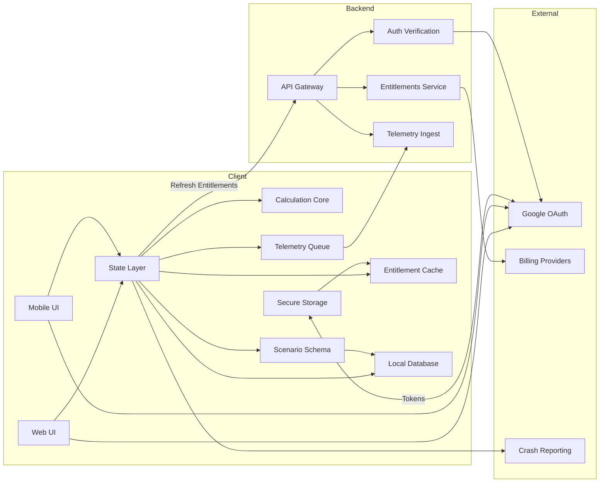

## Logical Architecture (v1)

Date: 2026-03-01

This document is an implementation-oriented explanation of the logical component architecture.
It is written to help GitHub Copilot (and humans) generate consistent code structure and boundaries.

Decision references:
- `ADR-001` (TypeScript + shared domain core)
- `ADR-007` (minimal AWS backend scope)
- `ADR-008` (entitlements offline grace)
- `ADR-013` (canonical web i18n/routing model)

---

## 1. Logical Component Diagram



---

## 2. Core Principles (must follow)

1. **Offline-first:** all scenario calculations and editing must work without network.
2. **Thin backend:** backend is only for auth verification, entitlements, and telemetry ingest.
3. **No financial values in backend:** scenario numeric values are stored only locally in V1.
4. **Shared calculation logic:** formula logic is centralized in `Calculation Core` and treated as pure functions.
5. **Strict boundaries:** UI should never implement formulas; State Layer calls Calculation Core.

---

## 3. Component Responsibilities (Copilot guidance)

### 3.1 Web UI (`WebUI`)
**Role:** TypeScript web application (vanilla DOM modules) with route-based rendering.

**Must do:**
- Render screens defined in UI blueprints.
- Delegate all business logic to `State Layer` and domain modules.
- Use `LocalDB` through repository interfaces only (no direct IndexedDB calls in UI components).

**Must not do:**
- Implement formulas.
- Call backend directly from UI components (use API client within State Layer).

---

### 3.2 Mobile UI (`MobileUI`)
**Role:** React Native screens and navigation.

**Must do:**
- Same as WebUI: display, input, UX flow.
- Delegate to `State Layer`.
- Use platform storage via repository layer.

**Must not do:**
- Implement formulas.
- Embed entitlement rules directly in UI components.

---

### 3.3 State Layer (`State`)
**Role:** ViewModel-style application layer that orchestrates:
- UI input state
- validation errors
- derived/computed values
- persistence
- entitlements
- telemetry batching

**Copilot implementation hint:**
- Use a ViewModel per screen (or per module workspace) with explicit inputs/outputs.
- Keep derived state computed via `CalcCore` only.

**Responsibilities:**
- Validate inputs (using `Schema` / validators).
- Compute results via `CalcCore`.
- Persist scenarios via `LocalDB` repository.
- Manage entitlements (read from `EntCache`, refresh via backend through `APIGW`).
- Queue telemetry events in `EventQueue`.

---

### 3.4 Calculation Core (`CalcCore`)
**Role:** Pure deterministic financial calculations.

**Rules:**
- Pure functions only (no I/O, no network, no DB).
- Accept structured inputs.
- Return structured outputs with explicit rounding.
- Use **numeric safety strategy** (minor units + decimal lib where needed).

**Example module structure:**
- `profit.ts` → profit, margin, total cost
- `breakeven.ts` → contribution margin, break-even units/revenue
- `cashflow.ts` → monthly net flow and balances

**Testing requirement:**
- Golden test vectors for each calculator.
- Snapshot tests for rounding and formatting rules.

---

### 3.5 Scenario Schema (`Schema`)
**Role:** Versioned schema and validators for scenarios and import/export.

**Responsibilities:**
- Validate scenario objects before save/import.
- Maintain `schemaVersion`.
- Provide migration functions between versions.

**Copilot hint:**
- Centralize all schema definitions in one package (shared TS).
- Expose `validateScenario()` and `migrateScenario()` functions.

---

### 3.6 Local Database (`LocalDB`)
**Role:** Local persistence of scenarios and metadata.

**Platforms:**
- Mobile: SQLite (SQLCipher encryption at rest)
- Web: IndexedDB (Dexie)

**Rules:**
- UI never touches DB directly.
- State Layer uses repositories:
    - `ScenarioRepository`
    - `SettingsRepository`
    - `EntitlementRepository` (cache)

**Data stored locally:**
- Scenarios (all numeric values)
- Entitlement cache (last verified time, entitlements)
- Telemetry queue (batched events)
- UI preferences (theme, locale format)

---

### 3.7 Secure Storage (`SecureStore`)
**Role:** Keep secrets out of plaintext storage.

**Stores:**
- Mobile: Keychain / Keystore
- Web: best-effort (in-memory + short-lived tokens)

**Holds:**
- OAuth tokens (mobile only persist)
- DB encryption key (mobile)
- Optional web vault passphrase (never stored; only derived key in memory)

---

### 3.8 Entitlement Cache (`EntCache`)
**Role:** Offline access control.

**Stored:**
- `lastVerifiedAt`
- `entitlementSet`
- trial timestamps (if applicable)

**Policy:**
- Offline grace TTL = 72h since last verification.
- Refresh: on app start when online; max once per 24h.

**UI rule:**
- Never block export due to entitlement refresh failure.

---

### 3.9 Telemetry Queue (`EventQueue`)
**Role:** Store minimal product events offline and batch-send.

**Rules:**
- Allowlist events only.
- No monetary values.
- Batch flush when network available.
- Drop/compact if queue exceeds size cap (to protect storage and cost).
- Runtime compatibility: queue byte-size accounting must work in browser and Node environments (do not rely on Node-only globals such as `Buffer` without fallback).

---

## 4. Backend Components (Copilot guidance)

### 4.1 API Gateway (`APIGW`)
**Role:** Single public API surface.

**Endpoints (suggested):**
- `POST /auth/verify`
- `GET /entitlements`
- `POST /billing/checkout/session`
- `POST /billing/webhook/stripe`
- `POST /telemetry/batch`

---

### 4.2 Auth Verification (`Auth`)
**Role:** Verify Google OAuth tokens and mint lightweight session claims (optional).

**Rules:**
- Verify token with Google.
- Never log tokens.
- Return minimal user identity (userId) and session metadata.

---

### 4.3 Entitlements Service (`Entitlements`)
**Role:** Compute entitlement set for a user.

**Responsibilities:**
- Read/write entitlement state in DB.
- Verify receipts/subscriptions with Apple/Google (server-side).
- Return stable `EntitlementSet` contract to clients.

**Contract (example):**
```json
{
  "userId": "u_123",
  "lastVerifiedAt": "2026-03-01T10:00:00Z",
  "entitlements": {
    "bundle": true,
    "profit": true,
    "breakeven": false,
    "cashflow": true
  },
  "trial": {
    "active": true,
    "expiresAt": "2026-03-10T00:00:00Z"
  }
}
```

---

### 4.4 Telemetry Ingest (`Telemetry`)
**Role:** Accept batched events and store raw payloads cheaply.

**Rules:**
- Validate schema.
- Reject events containing disallowed fields.
- Write raw to S3 (or another cheap store).
- Enforce retention policy.

---

## 5. External Providers

### Google OAuth
- Used for login.
- Backend may verify tokens.
- No passwords stored by us.

### Billing Providers
- Mobile purchases occur on-device.
- Backend verifies receipts/subscriptions and issues entitlements.

### Crash Reporting
- Direct from client apps.
- Do not send scenario values.

---

## 6. Suggested Repository Layout (Copilot-ready)

```
repo/
  apps/
    web/
    mobile/
  packages/
    domain-core/        # CalcCore + Schema + types + migrations
    storage/            # repos, adapters (sqlite, indexeddb), encryption helpers
    api-client/         # typed client for APIGW endpoints
    telemetry/          # EventQueue + allowlist + batching
    entitlements/       # EntCache + policy + gates
```

---

## 7. “Do / Don’t” Summary for Copilot

**DO**
- Put formulas only into `domain-core`.
- Keep State Layer as orchestrator and boundary.
- Keep DB access behind repositories.
- Make all network calls through typed API client.
- Enforce numeric safety and rounding policy.

**DON’T**
- Duplicate formulas in UI.
- Store monetary values in backend or telemetry.
- Call IndexedDB/SQLite directly from UI components.
- Log tokens or secrets.
