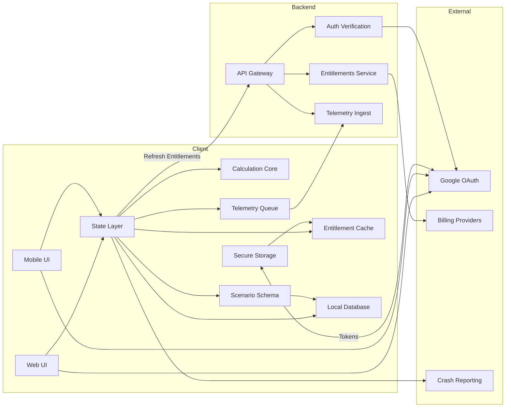

# SMB Finance Toolkit Architecture (v1)
Date: 2026-02-28  |  Scope: Web + iOS + Android (offline-first, minimal backend)

## Decisions locked
- Data: scenarios stored locally-first; cloud sync is out of V1 scope.
- Telemetry: minimal (crashes + a small set of product events), privacy-first.
- Entitlements: cached locally to support offline usage; backend used for refresh.
- Mobile data security: encrypt local scenario storage using platform keystore-managed key.

## Recommended defaults
- Entitlement cache TTL (offline grace): 72 hours since last successful verification. After that: keep dashboard accessible, lock modules, allow export.
- Entitlement refresh cadence: at app start (if online) + once per 24h in background when online.
- Import behavior in V1: Replace-all only (explicit warning + confirmation).

## Quality attributes table
| Quality Attribute | Measurable Target (v1) | Architecture Tactics / Patterns | Risks & Trade-offs | Acceptance / Tests |
|---|---|---|---|---|
| Cost Efficiency (Cloud Burn) | Backend <$X/mo at MVP traffic; client-side calc; storage costs linear and low | Thin backend; client-side calculation core; event budget; serverless + managed auth; CDN for web | Less server-side validation; careful schema validation needed client-side | Load test API calls per active user; monthly cost projection; verify no hidden egress/log costs |
| Offline-first Availability | Core features (create/edit/calc/export) work fully offline; online required only for login + entitlement refresh | Local-first storage; entitlement cache w/ TTL; retry + queue for events; network banner | Potential entitlement abuse during grace; need clear UX when stale | Simulate airplane mode: create/edit/calc/export; confirm lock after TTL; automated integration tests |
| Performance & Responsiveness | Cold start < 2s (mobile target), web TTI < 3s on mid device; calc updates < 50ms typical | Keep calc engine pure + incremental; memoization; virtualized lists; lazy-load charts; minimize JS bundle | Complex cashflow grids can get heavy; need bounded months and UI virtualization | Profiling on mid-range device; scenario list with 500 items; cashflow 24 months; verify FPS/latency |
| Reliability & Data Integrity | No scenario loss on crash; atomic saves; schema migrations safe | Transactional local DB (SQLite/IndexedDB); write-ahead/commit; versioned schema + migrations; backups via export | Migration bugs are painful; must keep strict versioning and tests | Kill app during save; reopen; data consistent. Migration test suite across versions. |
| Security (Auth, Tokens, Local Data) | Tokens never stored in plaintext logs; mobile data encrypted at rest; least-privilege backend | OAuth via Google; secure token storage (Keychain/Keystore); encrypt scenario DB with KEK in secure storage; TLS; no PII beyond email | Web local storage cannot be strongly encrypted in V1; clarify risk; keep minimal sensitive data | Security review checklist; verify tokens not in logs; penetration basics; local DB encryption checks on device |
| Privacy | Collect minimal events; no sale/targeting; user can export/delete local data | Event allowlist; sampling; on-device queue; avoid raw financial values in telemetry; redact | Less insight for growth; need discipline to not expand events | Telemetry unit tests (schema); verify no sensitive fields; DPIA-lite checklist |
| Maintainability & Modularity | Add new calculator module with minimal changes; shared patterns reused | Modular domain: core calc engine + UI shells; shared scenario schema; feature flags; clean interfaces | Over-abstracting can slow MVP; keep modules cohesive, not generic for its own sake | Codebase structure review; module template; time-to-add-demo-module spike |
| Portability (Web + iOS + Android) | Same calculations across platforms; same scenario JSON format | Single calculation core + shared tests; shared schema & validators; contract tests | Cross-platform numeric precision differences; must standardize rounding rules | Golden test vectors for formulas; snapshot tests for rounding & formatting |
| Observability (Low-Cost) | Crash-free > 99.5%; key funnel events tracked; debugging possible without noisy logs | Crash reporting; minimal structured events; error codes; local debug logs w/ user opt-in export | Too little data can slow product decisions | Dashboard of KPIs; verify event volume within budget; simulate offline queue flush |
| Accessibility & UX Consistency | Tap targets ≥ 44px; focus visible; consistent empty/error states | Token-based styling; reusable components (<EmptyState/>, <SystemError/>); localization-ready strings | Adds some upfront work; but prevents UI drift | Accessibility audit checklist; snapshot/UI tests of empty/error states |

## Entitlements offline policy (v1)
- Store: last_verified_at, entitlement_set, trial_started_at, trial_expires_at (if applicable).
- When online: refresh entitlements at startup and at most once per 24h (debounced).
- When offline: allow module access if last_verified_at <= 72h ago; otherwise lock modules but keep dashboard + export available.
- Never block export due to entitlement refresh failures (user data portability).

## Telemetry allowlist (v1)
- auth_login_success / auth_login_failure (reason code only)
- trial_started
- subscription_purchase_started / subscription_purchase_success / subscription_purchase_failed (reason code only)
- module_opened (moduleId)
- scenario_created / scenario_saved / scenario_deleted (moduleId only, no amounts)
- export_completed / import_completed / import_failed (reason code)
- app_crash (via crash SDK)

## Regulatory & Compliance Baseline (v1)
Date: 2026-02-28  |  Scope: Web + iOS + Android (EU primary market)

## 1. Applicable Regulations
- GDPR (EU General Data Protection Regulation) — applicable due to processing of personal data (email, user ID, telemetry identifiers).
- ePrivacy / Cookie Directive (Web) — applicable if non-essential cookies or analytics are used.
- Consumer protection law (EU) — applies to subscription transparency and billing clarity.
- PCI DSS — NOT directly applicable (payment processing delegated to Stripe / App Store / Google Play).

## 2. Personal Data Processed
- Google account email address.
- Internal user ID (generated).
- Subscription status and entitlement metadata.
- Telemetry events (non-financial, no scenario numeric values).
- Technical metadata (IP address via backend logs).

Note: Financial scenario values remain stored locally on device/browser in V1 (offline-first).

## 3. Data Minimization & Purpose Limitation
- No storage of scenario financial values in backend.
- Telemetry excludes monetary amounts and sensitive financial details.
- Only essential user identifiers stored server-side.
- No profiling, no marketing resale, no behavioral advertising.

## 4. Data Retention Policy (v1)
- Backend application logs: 30–90 days rolling retention.
- Telemetry: aggregated and anonymized where possible.
- User account metadata: retained while account active.
- Local scenario data: stored on device until user deletion or uninstall.

## 5. User Rights (GDPR Compliance)
- Right of access — user can request stored personal data.
- Right to data portability — scenario export (JSON).
- Right to erasure — account deletion mechanism (to be implemented).
- Right to transparency — Privacy Policy required.
- Right to withdraw consent (where applicable).

## 6. Security Controls (Baseline)
- OAuth via Google for authentication.
- Secure storage of tokens (Keychain / Keystore on mobile).
- Encryption at rest for local mobile scenario database.
- TLS enforced for all backend communication.
- Webhook signature verification for payment providers.

## 7. Data Hosting & Localization
- Backend hosted in EU region.
- No intentional cross-border data transfers outside EU in V1.
- If third-party services used, they must provide GDPR-compliant DPA.

## 8. Legal Artifacts Required Before Launch
- Privacy Policy (clear description of data processing).
- Terms of Service (including subscription and disclaimer).
- Disclaimer: Informational tool only. Not financial advice.
- Data Processing Agreements with providers (if required).

## Architecture Drivers (v1)
Date: 2026-02-28  |  Scope: Web + iOS + Android  |  EU-first, Global-ready

## 1. Business Drivers
- B1 — EU-first launch with global expansion readiness.
- B2 — Low operational cloud cost (thin backend, client-side calculations).
- B3 — Subscription-based monetization (trial, per-module, bundle).
- B4 — Product simplicity (lightweight financial toolkit, not ERP/accounting system).

## 2. Technical Drivers
- T1 — Offline-first architecture (core logic fully client-side).
- T2 — Cross-platform consistency (shared calculation logic & scenario schema).
- T3 — Data integrity and safe local persistence (no scenario loss).
- T4 — Secure-by-default design (OAuth, secure token storage, encrypted mobile storage).
- T5 — Minimal telemetry with privacy-first principles.

## 3. Dominant Quality Attribute Drivers
- Q1 — Availability (Offline capability mandatory).
- Q2 — Modifiability (new calculators must be pluggable with minimal refactor).
- Q3 — Cost-aware scalability (support growth without backend cost explosion).
- Q4 — Security & Compliance (GDPR baseline, minimal PII).
- Q5 — Performance (fast cold start, instant calculation feedback).

## 4. Architectural Impact Summary
- Calculation engine must be pure, shared, and testable across platforms.
- Backend limited to authentication, entitlement validation, and minimal telemetry.
- Local-first storage required on all platforms.
- Entitlement caching strategy required for offline grace period.
- EU-based hosting required for compliance baseline.
- 
## Logical Architecture (v1)

Date: 2026-03-01

This document is an implementation-oriented explanation of the logical component architecture.
It is written to help GitHub Copilot (and humans) generate consistent code structure and boundaries.

---

## 1. Logical Component Diagram



---

## 2. Core Principles (must follow)

1. **Offline-first:** all scenario calculations and editing must work without network.
2. **Thin backend:** backend is only for auth verification, entitlements, and telemetry ingest.
3. **No financial values in backend:** scenario numeric values are stored only locally in V1.
4. **Shared calculation logic:** formula logic is centralized in `Calculation Core` and treated as pure functions.
5. **Strict boundaries:** UI should never implement formulas; State Layer calls Calculation Core.

---

## 3. Component Responsibilities (Copilot guidance)

### 3.1 Web UI (`WebUI`)
**Role:** React web application screens and routing.

**Must do:**
- Render screens defined in UI blueprints.
- Delegate all business logic to `State Layer` and domain modules.
- Use `LocalDB` through repository interfaces only (no direct IndexedDB calls in UI components).

**Must not do:**
- Implement formulas.
- Call backend directly from UI components (use API client within State Layer).

---

### 3.2 Mobile UI (`MobileUI`)
**Role:** React Native screens and navigation.

**Must do:**
- Same as WebUI: display, input, UX flow.
- Delegate to `State Layer`.
- Use platform storage via repository layer.

**Must not do:**
- Implement formulas.
- Embed entitlement rules directly in UI components.

---

### 3.3 State Layer (`State`)
**Role:** ViewModel-style application layer that orchestrates:
- UI input state
- validation errors
- derived/computed values
- persistence
- entitlements
- telemetry batching

**Copilot implementation hint:**
- Use a ViewModel per screen (or per module workspace) with explicit inputs/outputs.
- Keep derived state computed via `CalcCore` only.

**Responsibilities:**
- Validate inputs (using `Schema` / validators).
- Compute results via `CalcCore`.
- Persist scenarios via `LocalDB` repository.
- Manage entitlements (read from `EntCache`, refresh via backend through `APIGW`).
- Queue telemetry events in `EventQueue`.

---

### 3.4 Calculation Core (`CalcCore`)
**Role:** Pure deterministic financial calculations.

**Rules:**
- Pure functions only (no I/O, no network, no DB).
- Accept structured inputs.
- Return structured outputs with explicit rounding.
- Use **numeric safety strategy** (minor units + decimal lib where needed).

**Example module structure:**
- `profit.ts` → profit, margin, total cost
- `breakeven.ts` → contribution margin, break-even units/revenue
- `cashflow.ts` → monthly net flow and balances

**Testing requirement:**
- Golden test vectors for each calculator.
- Snapshot tests for rounding and formatting rules.

---

### 3.5 Scenario Schema (`Schema`)
**Role:** Versioned schema and validators for scenarios and import/export.

**Responsibilities:**
- Validate scenario objects before save/import.
- Maintain `schemaVersion`.
- Provide migration functions between versions.

**Copilot hint:**
- Centralize all schema definitions in one package (shared TS).
- Expose `validateScenario()` and `migrateScenario()` functions.

---

### 3.6 Local Database (`LocalDB`)
**Role:** Local persistence of scenarios and metadata.

**Platforms:**
- Mobile: SQLite (SQLCipher encryption at rest)
- Web: IndexedDB (Dexie)

**Rules:**
- UI never touches DB directly.
- State Layer uses repositories:
    - `ScenarioRepository`
    - `SettingsRepository`
    - `EntitlementRepository` (cache)

**Data stored locally:**
- Scenarios (all numeric values)
- Entitlement cache (last verified time, entitlements)
- Telemetry queue (batched events)
- UI preferences (theme, locale format)

---

### 3.7 Secure Storage (`SecureStore`)
**Role:** Keep secrets out of plaintext storage.

**Stores:**
- Mobile: Keychain / Keystore
- Web: best-effort (in-memory + short-lived tokens)

**Holds:**
- OAuth tokens (mobile only persist)
- DB encryption key (mobile)
- Optional web vault passphrase (never stored; only derived key in memory)

---

### 3.8 Entitlement Cache (`EntCache`)
**Role:** Offline access control.

**Stored:**
- `lastVerifiedAt`
- `entitlementSet`
- trial timestamps (if applicable)

**Policy:**
- Offline grace TTL = 72h since last verification.
- Refresh: on app start when online; max once per 24h.

**UI rule:**
- Never block export due to entitlement refresh failure.

---

### 3.9 Telemetry Queue (`EventQueue`)
**Role:** Store minimal product events offline and batch-send.

**Rules:**
- Allowlist events only.
- No monetary values.
- Batch flush when network available.
- Drop/compact if queue exceeds size cap (to protect storage and cost).

---

## 4. Backend Components (Copilot guidance)

### 4.1 API Gateway (`APIGW`)
**Role:** Single public API surface.

**Endpoints (suggested):**
- `POST /auth/verify`
- `GET /entitlements`
- `POST /telemetry/batch`

---

### 4.2 Auth Verification (`Auth`)
**Role:** Verify Google OAuth tokens and mint lightweight session claims (optional).

**Rules:**
- Verify token with Google.
- Never log tokens.
- Return minimal user identity (userId) and session metadata.

---

### 4.3 Entitlements Service (`Entitlements`)
**Role:** Compute entitlement set for a user.

**Responsibilities:**
- Read/write entitlement state in DB.
- Verify receipts/subscriptions with Apple/Google (server-side).
- Return stable `EntitlementSet` contract to clients.

**Contract (example):**
```json
{
  "userId": "u_123",
  "lastVerifiedAt": "2026-03-01T10:00:00Z",
  "entitlements": {
    "bundle": true,
    "profit": true,
    "breakeven": false,
    "cashflow": true
  },
  "trial": {
    "active": true,
    "expiresAt": "2026-03-10T00:00:00Z"
  }
}
```

---

### 4.4 Telemetry Ingest (`Telemetry`)
**Role:** Accept batched events and store raw payloads cheaply.

**Rules:**
- Validate schema.
- Reject events containing disallowed fields.
- Write raw to S3 (or another cheap store).
- Enforce retention policy.

---

## 5. External Providers

### Google OAuth
- Used for login.
- Backend may verify tokens.
- No passwords stored by us.

### Billing Providers
- Mobile purchases occur on-device.
- Backend verifies receipts/subscriptions and issues entitlements.

### Crash Reporting
- Direct from client apps.
- Do not send scenario values.

---

## 6. Suggested Repository Layout (Copilot-ready)

```
repo/
  apps/
    web/
    mobile/
  packages/
    domain-core/        # CalcCore + Schema + types + migrations
    storage/            # repos, adapters (sqlite, indexeddb), encryption helpers
    api-client/         # typed client for APIGW endpoints
    telemetry/          # EventQueue + allowlist + batching
    entitlements/       # EntCache + policy + gates
```

---

## 7. “Do / Don’t” Summary for Copilot

**DO**
- Put formulas only into `domain-core`.
- Keep State Layer as orchestrator and boundary.
- Keep DB access behind repositories.
- Make all network calls through typed API client.
- Enforce numeric safety and rounding policy.

**DON’T**
- Duplicate formulas in UI.
- Store monetary values in backend or telemetry.
- Call IndexedDB/SQLite directly from UI components.
- Log tokens or secrets.

## AWS Deployment Architecture (v1)

Date: 2026-03-01

This document is an implementation-oriented deployment description (AWS EU) written to help GitHub Copilot generate:
- infra (Terraform layout),
- backend services (Lambda handlers, API contracts),
- web hosting config (SPA routing),
- security defaults (KMS, Secrets, IAM boundaries),
- cost controls (log retention, batching, throttles).

---

## 1. Deployment Diagram (Eraser)

```eraser
title: SMB Finance Toolkit — AWS Deployment (EU) (v1)

Client Devices {
  iOS Device {
    Mobile App (iOS) [icon: mobile]
    iOS Local DB (SQLite) [icon: database]
    iOS Secure Storage (Keychain) [icon: key]
  }

  Android Device {
    Mobile App (Android) [icon: mobile]
    Android Local DB (SQLite) [icon: database]
    Android Secure Storage (Keystore) [icon: key]
  }

  User Browser {
    Web App (SPA) [icon: browser]
    Web Local Store (IndexedDB) [icon: database]
  }
}

External Providers {
  Google OAuth [icon: google]
  Crash Reporting (SDK) [icon: bug]

  Billing / Subscriptions {
    App Store Billing [icon: credit-card]
    Google Play Billing [icon: credit-card]
  }
}

AWS (EU Region) {

  Edge {
    Route 53 [icon: aws-route-53]
    CloudFront [icon: aws-cloudfront]
  }

  Static Hosting {
    Web App Assets (S3) [icon: aws-s3]
  }

  API Layer {
    API Gateway (HTTP API) [icon: aws-api-gateway]
  }

  Compute {
    Auth Lambda [icon: aws-lambda]
    Entitlements Lambda [icon: aws-lambda]
    Telemetry Lambda [icon: aws-lambda]
  }

  Data {
    Entitlements (DynamoDB) [icon: aws-dynamodb]
    Telemetry Storage (S3) [icon: aws-s3]
  }

  Security {
    KMS [icon: aws-kms]
    Secrets Manager [icon: aws-secrets-manager]
    CloudWatch [icon: aws-cloudwatch]
  }
}

%% Web delivery
User Browser -> Route 53
Route 53 -> CloudFront
CloudFront -> Web App Assets (S3)

%% API calls
Mobile App (iOS) -> API Gateway (HTTP API)
Mobile App (Android) -> API Gateway (HTTP API)
Web App (SPA) -> API Gateway (HTTP API)

%% Auth flow
Mobile App (iOS) -> Google OAuth
Mobile App (Android) -> Google OAuth
Web App (SPA) -> Google OAuth

API Gateway (HTTP API) -> Auth Lambda
Auth Lambda -> Google OAuth

%% Purchase flow (device -> store)
Mobile App (iOS) -> App Store Billing
Mobile App (Android) -> Google Play Billing

%% Subscription verification / entitlements (backend -> store APIs)
API Gateway (HTTP API) -> Entitlements Lambda
Entitlements Lambda -> Entitlements (DynamoDB)
Entitlements Lambda -> App Store Billing
Entitlements Lambda -> Google Play Billing

%% Telemetry
API Gateway (HTTP API) -> Telemetry Lambda
Telemetry Lambda -> Telemetry Storage (S3)

%% Observability
Auth Lambda -> CloudWatch
Entitlements Lambda -> CloudWatch
Telemetry Lambda -> CloudWatch

%% Secrets / keys
Auth Lambda -> Secrets Manager
Entitlements Lambda -> Secrets Manager
Telemetry Lambda -> Secrets Manager
Secrets Manager -> KMS
Telemetry Storage (S3) -> KMS
Entitlements (DynamoDB) -> KMS

%% Crash reporting direct
Mobile App (iOS) -> Crash Reporting (SDK)
Mobile App (Android) -> Crash Reporting (SDK)
Web App (SPA) -> Crash Reporting (SDK)
```

---

## 2. Goals & Constraints (must follow)

1. **EU-first:** all AWS resources must be deployed in an EU region.
2. **Low cloud burn:** serverless, minimal storage, tight telemetry budget.
3. **No scenario data in cloud:** scenario numeric values remain local-only in V1.
4. **Offline-first:** clients continue to work if backend is unreachable.
5. **Security baseline:** TLS everywhere, least-privilege IAM, secrets never logged.

---

## 3. Runtime Environments (Copilot guidance)

### 3.1 Web Client (Browser)
- Delivered as a static SPA from **S3 + CloudFront**.
- Stores scenarios in **IndexedDB** (local).
- Calls backend for **entitlements refresh** and **telemetry batch upload** only.
- Uses Google OAuth for login.

### 3.2 Mobile Clients (iOS / Android)
- Store scenarios in **SQLite** locally.
- Mobile DB encrypted (SQLCipher); encryption key stored in Keychain/Keystore.
- Purchases happen **on-device** via store billing.
- Backend performs **receipt/subscription verification** and returns entitlements.
- Crash reporting goes directly to the chosen crash SDK vendor.

---

## 4. AWS Components — Responsibilities & “Copilot boundaries”

### 4.1 Route 53 + CloudFront (Edge)
**Purpose:** HTTPS entry, caching, global edge delivery.

**Copilot implementation notes:**
- Configure CloudFront behavior to serve SPA routes (`/*`) with **fallback to `/index.html`**.
- Enforce HTTPS redirect.
- Use long cache headers for hashed assets; shorter for HTML.

---

### 4.2 S3 (Web App Assets)
**Purpose:** Store the web build output (static files).

**Must:**
- Block public access; CloudFront OAC/OAI only.
- Enable versioning (optional but recommended).
- Default encryption at rest (SSE-S3 or SSE-KMS).

---

### 4.3 API Gateway (HTTP API)
**Purpose:** Single backend entrypoint with minimal endpoints.

**Suggested endpoints:**
- `POST /auth/verify`
- `GET /entitlements`
- `POST /telemetry/batch`

**Rules:**
- Strict request/response schema (typed).
- Rate limit / throttling knobs (later: WAF or usage plans).

---

### 4.4 Auth Lambda (Auth Verification)
**Purpose:** Verify Google OAuth tokens (server-side).

**Must:**
- Verify token with Google.
- Never log raw tokens.
- Return minimal identity: `userId` (internal) + email (optional) + session metadata.
- Optionally mint internal signed session claims (future).

**Copilot hint:**
- Use a shared TypeScript type contract in `packages/api-contracts` (or similar).
- Use structured logging with redaction.

---

### 4.5 Entitlements Lambda
**Purpose:** Provide trial + subscription entitlements to clients.

**Responsibilities:**
- Read/write entitlement state in DynamoDB.
- Verify iOS/Android receipts/subscriptions (server-side) with the stores.
- Return stable `EntitlementSet` contract (cached by clients).

**Contract (example):**
```json
{
  "userId": "u_123",
  "lastVerifiedAt": "2026-03-01T10:00:00Z",
  "entitlements": {
    "bundle": true,
    "profit": true,
    "breakeven": false,
    "cashflow": true
  },
  "trial": {
    "active": true,
    "expiresAt": "2026-03-10T00:00:00Z"
  }
}
```

**Offline policy (client-side, enforced by app):**
- If `lastVerifiedAt` <= 72h: allow module access offline.
- If stale: keep dashboard accessible, lock modules, always allow export.

---

### 4.6 DynamoDB (Entitlements)
**Purpose:** Minimal PII persistence for entitlement status.

**Stored data (minimize):**
- `userId` (PK)
- entitlement flags / subscription metadata (no financial scenario data)
- `trialStartedAt`, `trialExpiresAt`
- `updatedAt`

**Copilot infra hint:**
- Use on-demand billing to start.
- Encrypt with KMS.
- Add TTL attributes if we store ephemeral records.

---

### 4.7 Telemetry Lambda + Telemetry S3
**Purpose:** Accept a batch of allowlisted events and write raw payloads to S3 cheaply.

**Must:**
- Reject events with disallowed fields (especially monetary values).
- Enforce max batch size and rate limits.
- Write objects to S3 with time-partitioned keys:
    - `s3://telemetry-raw/YYYY/MM/DD/<userId>/<uuid>.json`
- Set S3 lifecycle retention (30–90 days).

**Copilot note:**
- Keep CloudWatch logs minimal (don’t log full payloads).
- Prefer metrics counters (counts) over verbose logs.

---

### 4.8 Secrets Manager + KMS
**Purpose:** Central secret storage + encryption keys.

**Secrets:**
- Store verification credentials (if required).
- Webhook secrets / signing keys (future web payments).
- Any API keys for telemetry/crash vendor (if backend needs them).

**KMS usage:**
- Encrypt DynamoDB and S3 buckets.
- Rotate keys (managed policy).

---

### 4.9 CloudWatch
**Purpose:** Minimal observability without cost blow-ups.

**Must:**
- Short retention for logs (e.g., 7–14 days to start).
- Use structured logs with strict redaction.
- Track key metrics: error rate per Lambda, latency p95, request counts.

---

## 5. Cost Control “Knobs” (Copilot should implement these)

1. **Telemetry batching** on clients + strict allowlist.
2. **Debounce entitlements refresh** (start when online; max once per 24h).
3. **CloudWatch log retention** kept low.
4. **S3 lifecycle** for telemetry raw objects.
5. **Avoid chatty APIs**: do not call backend on every keystroke or calc step.

---

## 6. Security & Compliance Notes

- **GDPR baseline:** minimal PII; EU region hosting; privacy policy required.
- **No sensitive values** in telemetry and backend storage.
- **Token hygiene:** never log OAuth tokens; store only in mobile secure stores.
- **Transport security:** enforce TLS; HSTS via CloudFront.

---

## 7. Suggested Terraform Layout (Copilot-ready)

```
infra/
  envs/
    dev/
    prod/
  modules/
    edge_cloudfront_s3/
    api_gateway_http/
    lambda_service/
    dynamodb_entitlements/
    s3_telemetry_raw/
    kms/
    secrets/
    observability_cloudwatch/
  stacks/
    web_hosting.tf
    backend_api.tf
    data.tf
    security.tf
```
**Rules:**
- Keep env separation strict (different state backends).
- Use remote state (S3 + DynamoDB lock) in EU region.
- Output variables for: API base URL, CloudFront domain, bucket names.

---

## 8. “Do / Don’t” Summary for Copilot

**DO**
- Keep backend stateless and minimal.
- Validate payloads strictly.
- Redact logs and limit retention.
- Use KMS encryption for S3/DynamoDB.
- Implement client-side batching and refresh debouncing.

**DON’T**
- Store scenario values in DynamoDB/S3 (backend).
- Log tokens, receipts, or full telemetry payloads.
- Build complex server-side business logic in V1.
- Call backend frequently from UI events.

## Technology Stack & Rationale (v1)

Date: 2026-03-01

This document explains **what technologies we use, why**, and how GitHub Copilot should apply them when generating code.
Scope: Web + iOS + Android (offline-first) + minimal AWS backend (EU).

---

## 1. High-Level Stack Summary

### Client
- **Web:** React + TypeScript + Vite
- **Mobile:** React Native (Bare) + TypeScript
- **Shared:** `domain-core` (TypeScript) for calculations + schema + migrations

### Local Storage
- **Mobile:** SQLite + **SQLCipher** (encrypted at rest)
- **Web:** IndexedDB (Dexie) + optional **Local Vault** (WebCrypto AES-GCM)

### Backend (AWS EU)
- API Gateway (HTTP API)
- Lambda (Node.js/TypeScript)
- DynamoDB (entitlements)
- S3 (telemetry raw + web assets)
- CloudFront + Route53
- KMS, Secrets Manager, CloudWatch
- IaC: **Terraform**

### Auth / Billing / Observability
- Auth: **Google OAuth**
- Billing: **Store billing on-device** + backend verification (Apple/Google)
- Crashes: dedicated crash SDK vendor (direct from clients)
- Telemetry: allowlist events + batching to backend + S3 raw storage

---

## 2. Why This Stack (Drivers → Tech Mapping)

### Offline-first + Low Cloud Cost
- Scenarios are **local-only in V1**, so the backend stays thin and cheap.
- All calculations run client-side via `domain-core`.
- Local-first storage: SQLite/IndexedDB.

### Cross-Platform Consistency
- TypeScript everywhere.
- Single `domain-core` avoids formula drift between Web and Mobile.

### Security / Compliance (EU-first)
- Minimal PII in backend; EU-region hosting.
- Mobile data encrypted with SQLCipher; secrets in Keychain/Keystore.
- Telemetry excludes monetary values.

### Global-ready Payments (Later Web Expansion)
- Mobile uses Apple/Google stores.
- Web uses **Paddle (Merchant of Record)** when introduced → reduces tax/legal overhead for multi-country growth.

---

## 3. Detailed Tech Choices (What + For What)

### 3.1 Web: React + Vite + TypeScript
**Use for:**
- SPA screens, routing, rendering charts/tables, importing/exporting JSON.

**Why:**
- Fast dev loop, small bundles, predictable TS typing.

**Copilot rules:**
- Keep UI “dumb”: no formulas, no DB direct calls.
- Use typed ViewModels (State Layer) and repositories.

---

### 3.2 Mobile: Bare React Native + TypeScript
**Use for:**
- Native-feel experience, store billing, encrypted storage.

**Why Bare RN (not Expo managed):**
- SQLCipher + billing SDKs + crypto require native control.

**Copilot rules:**
- Prefer native modules where needed (SQLCipher bindings).
- Keep platform-specific code isolated under adapters.

---

### 3.3 Shared Domain: `packages/domain-core`
**Contains:**
- **Calculation Core** (Profit / Break-even / Cashflow) as pure functions
- Scenario schema + validators
- Migrations between schema versions
- Rounding + formatting rules (logic-level)

**Why:**
- One source of truth; easiest regression testing.

**Copilot rules:**
- Domain functions must be pure (no I/O).
- Add golden test vectors for each formula set.

---

## 4. Numeric Precision (Safe Finance Math)

### Decision
- Monetary amounts stored as **minor units** (e.g., cents) using `bigint` where appropriate.
- Ratios/percentages use a **decimal library** (e.g., `decimal.js` or `big.js`).
- Rounding policy is explicit (e.g., HALF_UP) and centralized.

**Copilot rules:**
- Never do finance math using raw floating point.
- Always convert display ↔ minor units via a single helper module.
- Add tests for rounding boundaries.

---

## 5. Local Storage Strategy

### 5.1 Mobile: SQLite + SQLCipher
**What stored:**
- Scenarios (all numeric values)
- Entitlement cache (`lastVerifiedAt`, flags)
- Telemetry queue (batched)
- Settings

**How:**
- SQLCipher encrypts DB file.
- Encryption key stored in Keychain/Keystore.
- Repository layer provides CRUD and migrations.

**Copilot rules:**
- UI must not access SQLite directly.
- Use repository interfaces + adapter implementations.
- Ensure atomic writes and migration tests.

### 5.2 Web: IndexedDB (Dexie) + Optional Local Vault
**Default:**
- IndexedDB for scenarios/settings/events.
- Document that web at-rest encryption is not guaranteed by platform.

**Local Vault (available to all paid users):**
- Optional passphrase-based encryption:
    - derive key via WebCrypto
    - encrypt values AES-GCM
- Passphrase is never stored or sent to backend.

**Copilot rules:**
- Implement Local Vault as a wrapper around repository layer (encrypt/decrypt at boundary).
- Keep “vault enabled” state in settings and enforce paywall via `EntitlementSet`.

---

## 6. Backend Stack (AWS EU)

### 6.1 API Gateway (HTTP API)
Endpoints:
- `POST /auth/verify`
- `GET /entitlements`
- `POST /telemetry/batch`

**Copilot rules:**
- Strict request/response validation.
- Return typed errors with stable codes (no stack traces).

### 6.2 Lambda (Node.js/TypeScript)
Functions:
- Auth verification (verify Google token)
- Entitlements (verify receipts + return entitlement set)
- Telemetry ingest (allowlist + write to S3)

**Copilot rules:**
- Never log secrets, tokens, receipts.
- Keep functions stateless.
- Use structured logs with redaction.
- Keep CloudWatch logs minimal.

### 6.3 DynamoDB (Entitlements)
**What stored:**
- Minimal PII: `userId`, entitlement flags, trial timestamps, updatedAt
- No scenario values ever

**Copilot rules:**
- Keep table simple; design can be expanded later.
- Encrypt with KMS.

### 6.4 Telemetry Storage (S3)
- Raw events, time-partitioned keys
- Lifecycle retention 30–90 days

**Copilot rules:**
- Enforce allowlist and payload size caps.
- Do not store amounts.

---

## 7. Auth & Billing

### 7.1 Google OAuth
- Client sign-in
- Backend verification as needed

**Copilot rules:**
- Tokens never in logs.
- Mobile tokens stored only in secure storage.

### 7.2 Store Billing
- Purchases happen on device
- Backend does verification (Apple/Google) and issues entitlements

**Copilot rules:**
- Keep provider-specific code behind interfaces (BillingAdapter).
- Unify results into one `EntitlementSet` contract.

### 7.3 Web Billing (Later): Paddle (MoR)
- Handles taxes and receipts as merchant of record
- Integrates into same entitlements model

---

## 8. Infrastructure as Code: Terraform

**Why:**
- Standard, reproducible, env separation.

**Copilot rules:**
- Use module-based structure.
- Keep dev/prod isolated state.
- Outputs: API base URL, CloudFront domain, bucket names.

Suggested layout:
```
infra/
  envs/dev
  envs/prod
  modules/
    edge_cloudfront_s3/
    api_gateway_http/
    lambda_service/
    dynamodb_entitlements/
    s3_telemetry_raw/
    security_kms_secrets/
    observability_cloudwatch/
```

---

## 9. “Copilot Do / Don’t” (Hard Rules)

### DO
- Put formulas only into `domain-core`.
- Use minor-units and explicit rounding helpers.
- Keep DB behind repositories.
- Batch telemetry, debounce entitlements refresh.
- Keep backend stateless and minimal.

### DON’T
- Duplicate formulas in UI.
- Use float math for money.
- Store scenario values in backend or telemetry.
- Log tokens/receipts or full telemetry payloads.
- Make backend required for core usage (offline-first must hold).

---

## 10. Implementation Checklist (First Sprint)

1. Create monorepo skeleton: `apps/web`, `apps/mobile`, `packages/domain-core`
2. Implement numeric helpers + rounding policy in `domain-core`
3. Implement scenario schema v1 + validators + golden test vectors
4. Implement LocalDB repositories for web (Dexie) and mobile (SQLite placeholder)
5. Implement basic entitlement cache + gate behavior in client
6. Stub backend endpoints (Terraform + Lambda skeleton) in EU region

## Architecture Decision Records (v1)

Date: 2026-03-01 Status: Accepted baseline decisions before
implementation.

# ADR-001: Unified TypeScript Stack (React + React Native) and Shared Domain Core

Date: 2026-03-01 Status: Accepted

## Context

Need cross-platform consistency, minimal duplication, strong typing, and
Copilot-friendly development.

## Decision

Use TypeScript across Web and Mobile. Implement shared `domain-core`
package with pure calculation functions and shared types.

## Consequences

### Positive

-   Single source of truth for calculations
-   Reduced drift between platforms
-   Strong typing across layers

### Negative

-   Requires discipline to keep domain-core framework-free
-   Floating point risks must be explicitly handled

### Operational Impact

Minimal operational complexity increase beyond defined stack.

### Security / Compliance Impact

Aligned with GDPR-first baseline and EU hosting constraints.

### Alternatives Considered

Discussed during architecture phase and intentionally rejected in favor
of chosen solution.

# ADR-002: Offline-First Data Ownership

Date: 2026-03-01 Status: Accepted

## Context

Core driver is offline-first usage and minimal cloud cost.

## Decision

Store all scenarios locally (SQLite mobile, IndexedDB web). No cloud
sync in V1.

## Consequences

### Positive

-   Works without network
-   Lower compliance risk
-   Minimal backend storage costs

### Negative

-   No cross-device sync in V1
-   Requires robust local migration strategy

### Operational Impact

Minimal operational complexity increase beyond defined stack.

### Security / Compliance Impact

Aligned with GDPR-first baseline and EU hosting constraints.

### Alternatives Considered

Discussed during architecture phase and intentionally rejected in favor
of chosen solution.

# ADR-003: Numeric Precision Strategy

Date: 2026-03-01 Status: Accepted

## Context

Financial calculations require deterministic, safe numeric handling.

## Decision

Store monetary values as minor units (cents). Use decimal library for
ratios and enforce explicit rounding policy.

## Consequences

### Positive

-   Eliminates floating point drift
-   Predictable financial outputs

### Negative

-   Slight increase in implementation complexity

### Operational Impact

Minimal operational complexity increase beyond defined stack.

### Security / Compliance Impact

Aligned with GDPR-first baseline and EU hosting constraints.

### Alternatives Considered

Discussed during architecture phase and intentionally rejected in favor
of chosen solution.

# ADR-004: Encrypted Mobile Storage

Date: 2026-03-01 Status: Accepted

## Context

Financial scenario data is business-sensitive.

## Decision

Use SQLite + SQLCipher. Store encryption key in Keychain/Keystore.

## Consequences

### Positive

-   Encryption at rest on mobile
-   Stronger security posture

### Negative

-   More complex native setup
-   Slight performance overhead

### Operational Impact

Minimal operational complexity increase beyond defined stack.

### Security / Compliance Impact

Aligned with GDPR-first baseline and EU hosting constraints.

### Alternatives Considered

Discussed during architecture phase and intentionally rejected in favor
of chosen solution.

# ADR-005: Web Local Vault (Paid Users)

Date: 2026-03-01 Status: Accepted

## Context

Web local storage cannot guarantee device-level encryption.

## Decision

Provide optional passphrase-based encryption (WebCrypto AES-GCM)
available to all paid users.

## Consequences

### Positive

-   Additional security for web users
-   No cloud exposure of keys

### Negative

-   If passphrase lost, data unrecoverable
-   Additional UX complexity

### Operational Impact

Minimal operational complexity increase beyond defined stack.

### Security / Compliance Impact

Aligned with GDPR-first baseline and EU hosting constraints.

### Alternatives Considered

Discussed during architecture phase and intentionally rejected in favor
of chosen solution.

# ADR-006: React Native Runtime Choice

Date: 2026-03-01 Status: Accepted

## Context

Need flexibility for encryption, billing SDKs, and long-term
maintainability.

## Decision

Use Bare React Native (not Expo managed).

## Consequences

### Positive

-   Full native control
-   Easier integration of encryption and billing SDKs

### Negative

-   More setup complexity vs Expo managed

### Operational Impact

Minimal operational complexity increase beyond defined stack.

### Security / Compliance Impact

Aligned with GDPR-first baseline and EU hosting constraints.

### Alternatives Considered

Discussed during architecture phase and intentionally rejected in favor
of chosen solution.

# ADR-007: Minimal AWS Backend Scope

Date: 2026-03-01 Status: Accepted

## Context

Cloud cost and compliance minimization are key drivers.

## Decision

Backend limited to Auth verification, Entitlements service, and
Telemetry ingest. No scenario storage.

## Consequences

### Positive

-   Low cloud cost
-   Smaller attack surface
-   GDPR-friendly

### Negative

-   Requires careful entitlement caching design

### Operational Impact

Minimal operational complexity increase beyond defined stack.

### Security / Compliance Impact

Aligned with GDPR-first baseline and EU hosting constraints.

### Alternatives Considered

Discussed during architecture phase and intentionally rejected in favor
of chosen solution.

# ADR-008: Entitlements Offline Grace Model

Date: 2026-03-01 Status: Accepted

## Context

Subscriptions must work offline without constant backend calls.

## Decision

Cache entitlement set locally with 72-hour TTL grace. Refresh max once
per 24h when online.

## Consequences

### Positive

-   Predictable offline UX
-   Controlled API usage

### Negative

-   Short-term entitlement abuse window possible

### Operational Impact

Minimal operational complexity increase beyond defined stack.

### Security / Compliance Impact

Aligned with GDPR-first baseline and EU hosting constraints.

### Alternatives Considered

Discussed during architecture phase and intentionally rejected in favor
of chosen solution.

# ADR-009: Web Hosting Model (AWS)

Date: 2026-03-01 Status: Accepted

## Context

Need cheap, scalable hosting.

## Decision

Host SPA on S3 + CloudFront. API via API Gateway + Lambda in EU region.

## Consequences

### Positive

-   Low cost
-   High availability
-   Simple deployment

### Negative

-   Requires correct SPA routing config

### Operational Impact

Minimal operational complexity increase beyond defined stack.

### Security / Compliance Impact

Aligned with GDPR-first baseline and EU hosting constraints.

### Alternatives Considered

Discussed during architecture phase and intentionally rejected in favor
of chosen solution.

# ADR-010: Payments Strategy (Global-Ready)

Date: 2026-03-01 Status: Accepted

## Context

Need minimal tax/legal complexity for global expansion.

## Decision

Mobile: native store billing. Web: Paddle as Merchant of Record.

## Consequences

### Positive

-   VAT/sales tax handled externally
-   Easier global expansion

### Negative

-   Dependency on third-party provider

### Operational Impact

Minimal operational complexity increase beyond defined stack.

### Security / Compliance Impact

Aligned with GDPR-first baseline and EU hosting constraints.

### Alternatives Considered

Discussed during architecture phase and intentionally rejected in favor
of chosen solution.

# ADR-011: Infrastructure as Code

Date: 2026-03-01 Status: Accepted

## Context

Need reproducible infrastructure and team scalability.

## Decision

Use Terraform for AWS infrastructure.

## Consequences

### Positive

-   Industry standard
-   Clear environment separation

### Negative

-   Requires Terraform expertise and discipline

### Operational Impact

Minimal operational complexity increase beyond defined stack.

### Security / Compliance Impact

Aligned with GDPR-first baseline and EU hosting constraints.

### Alternatives Considered

Discussed during architecture phase and intentionally rejected in favor
of chosen solution.

# ADR-012: State Management Strategy

Date: 2026-03-01 Status: Accepted

## Context

Need predictable UI state without heavy frameworks.

## Decision

Use React hooks + Zustand for lightweight global state.

## Consequences

### Positive

-   Simple and scalable
-   Avoids Redux-level complexity

### Negative

-   Requires conventions to prevent state sprawl

### Operational Impact

Minimal operational complexity increase beyond defined stack.

### Security / Compliance Impact

Aligned with GDPR-first baseline and EU hosting constraints.

### Alternatives Considered

Discussed during architecture phase and intentionally rejected in favor
of chosen solution.


